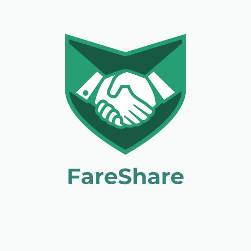

# Introducing, FareShare 💸 ✈️!

#### [FareShare Deployed App](https://fareshare-ba0541f3222e.herokuapp.com)  

## Description

FareShare is a browser-based cost-sharing application built with Django that helps friends, family, and groups **split expenses fairly and transparently** for any shared trip or event. Each “Share” represents a trip or occasion, while individual “Fares” record the specific expenses tied to that Share.  

After signing up, users can create Shares, invite participants, and log expenses with key details like category, payer, and amount. FareShare automatically calculates totals, category breakdowns, and **personal balances**, showing who owes who.

The dashboard and Share detail pages include clean visual summaries of total expenses, individual contributions, and balances per participant, keeping every member of the group on the same page. Each user only sees Shares they’re a part of, and the creator is automatically included as a participant to ensure visibility and security.  

#### Background Info

I created FareShare to solve a common problem: splitting costs for trips, dinners, or group events fairly without relying on messy notes or manual math. Whether it’s dividing up the cost of an Airbnb, a bar tab, or a group meal, FareShare makes the process effortless and accurate **to help people focus on the fun parts of shared experiences, not the finances.** 

## External Resources / Attributions

#### [Project Planning Materials](https://trello.com/b/YTyRQ7rB/project-4-fareshare)  

All functionality was developed using my own Django, Python, and frontend knowledge gained throughout the course. Regular reference checks were made to Django documentation, MDN Web Docs, and lesson materials. Generative AI assistance was used at times for syntax refinement and CSS structuring.

## Technologies Used

Python, Django (including authentication), PostgreSQL, HTML, CSS, Git, GitHub.

## Next Steps & Planned Future Enhancements

**User Profiles & Dashboards:**  
- Introduce personalized profile pages for each user showing total expenses and net balances across all Shares along with profile editing.

**Smart Balancing Logic:**  
- Display payment settlement suggestions.  
- Integrate weighted-split options for fares.

**Share Invitations:**  
- Allow creators to send invites or share join links so friends can easily become participants in a Share.  

**Enhance Share / Fare Experience:**  
- Allows participants to append photos to each share / fare to better document expenses and experiences. 
- Incorporate ability for users to leave a share if they no longer wish to participate.
